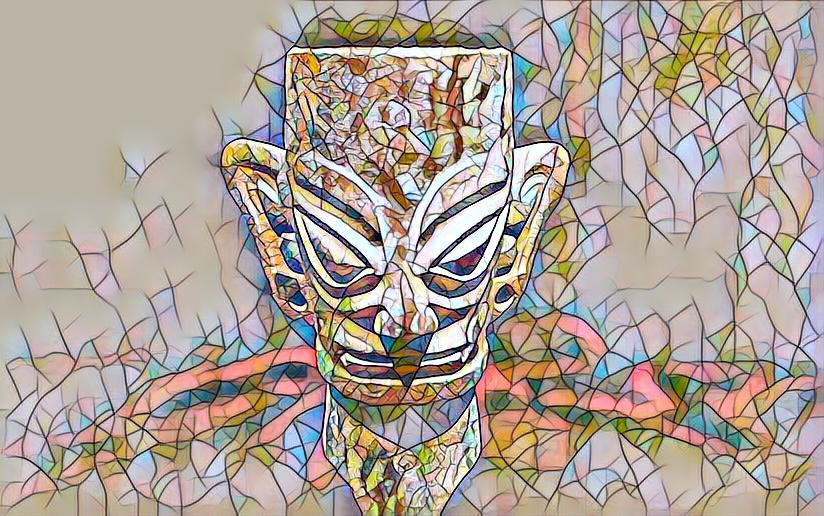
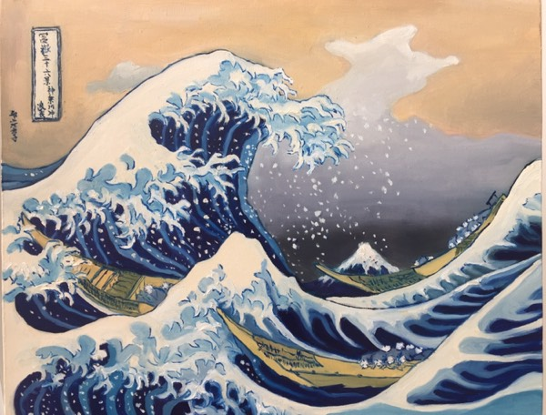
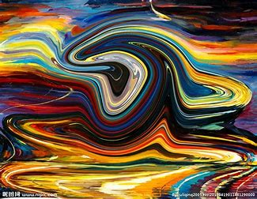
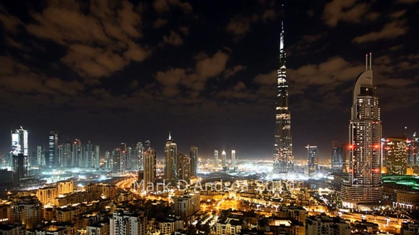
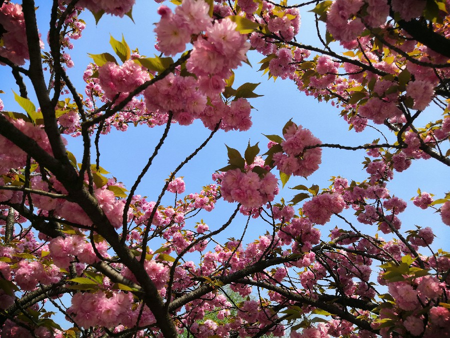
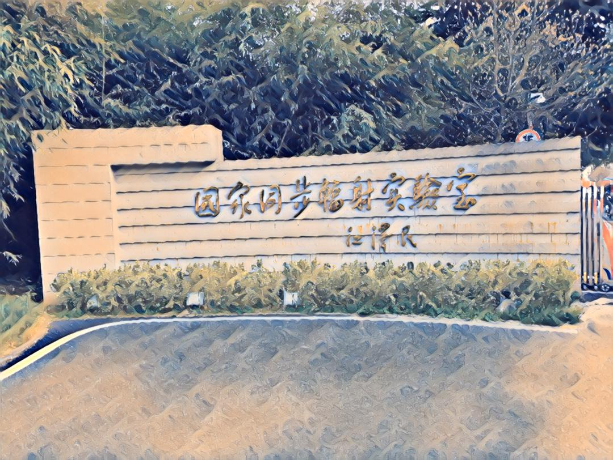
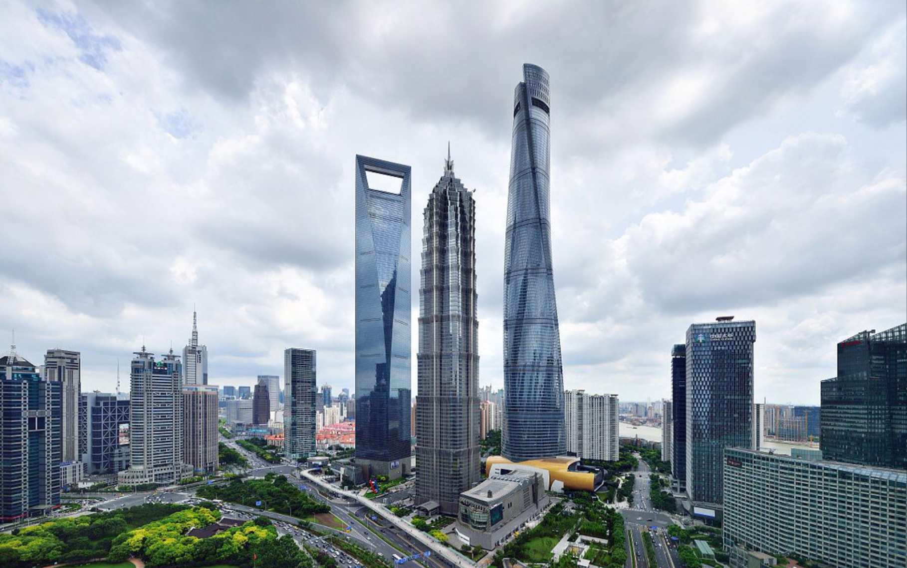
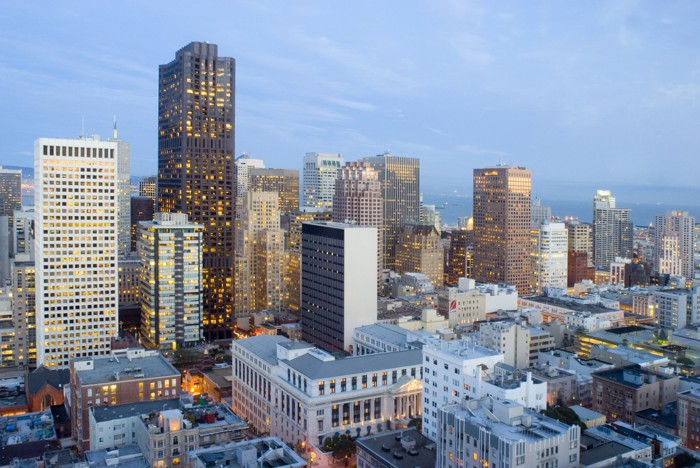
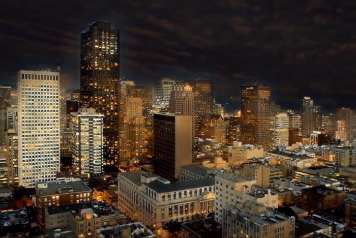

# fast-neural-style :city_sunrise: :rocket:
My implementation of fast-neural-style-transfer

The model uses the method described in [Perceptual Losses for Real-Time Style Transfer and Super-Resolution](https://arxiv.org/abs/1603.08155) along with [Instance Normalization](https://arxiv.org/pdf/1607.08022.pdf). The saved-models for examples shown in the README can be downloaded from [here](https://www.dropbox.com/s/lrvwfehqdcxoza8/saved_models.zip?dl=0).

<p align="center">
    
    
    
</p>


## Requirements
The program is written in Python, and uses [pytorch](http://pytorch.org/), [scipy](https://www.scipy.org). A GPU is not necessary, but can provide a significant speed up especially for training a new model. Regular sized images can be styled on a laptop or desktop using saved models.

## Usage
Stylize image
```
python neural_style/neural_style.py eval --content-image </path/to/content/image> --model </path/to/saved/model> --output-image </path/to/output/image> --cuda 0
```
* `--content-image`: path to content image you want to stylize.
* `--model`: saved model to be used for stylizing the image (eg: `mosaic.pth`, I trained several models on the platform of **Bitahub**,  the path is  /model/)
* `--output-image`: path for saving the output image.
* `--content-scale`: factor for scaling down the content image if memory is an issue (eg: value of 2 will halve the height and width of content-image)
* `--cuda`: set it to 1 for running on GPU, 0 for CPU.

Train model
```bash
python neural_style/neural_style.py train --dataset </path/to/train-dataset> --style-image </path/to/style/image> --save-model-dir </path/to/save-model/folder> --epochs 2 --cuda 1
```

There are several command line arguments, the important ones are listed below
* `--dataset`: path to training dataset, the path should point to a folder containing another folder with all the training images. I used COCO 2014 Training images dataset [80K/13GB] [(download)](https://cocodataset.org/#download). Remember to put the dataset in the subfolder. 
* `--style-image`: path to style-image.
* `--save-model-dir`: path to folder where trained model will be saved.
* `--cuda`: set it to 1 for running on GPU, 0 for CPU.

Refer to ``neural_style/neural_style.py`` for other command line arguments. For training new models you might have to tune the values of `--content-weight` and `--style-weight`. The mosaic style model shown above was trained with `--content-weight 1e5` and `--style-weight 1e10`. The remaining 3 models were also trained with similar order of weight parameters with slight variation in the `--style-weight` (`5e10` or `1e11`).

## Models

Models for the examples shown below can be downloaded from [here](https://www.dropbox.com/s/lrvwfehqdcxoza8/saved_models.zip?dl=0) or by running the script ``download_saved_models.py``.


I trained these these styles, the model can be found in the /model/ folder

<div align='center'>
  
  
</div>

<div align='center'>
  
  
  
</div>

I ran fast neural style transfer on some pictures. Here are the effects

<div align='center'>
  
  
<bar>
  
  
<bar>
  
  
   
<bar>
  
  
</div>
