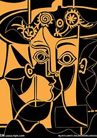
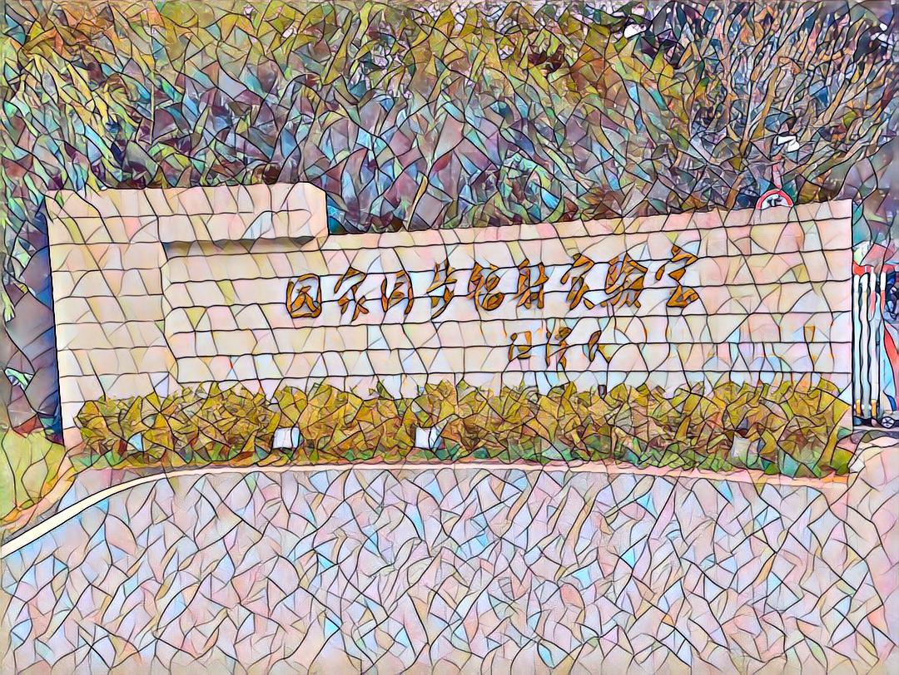
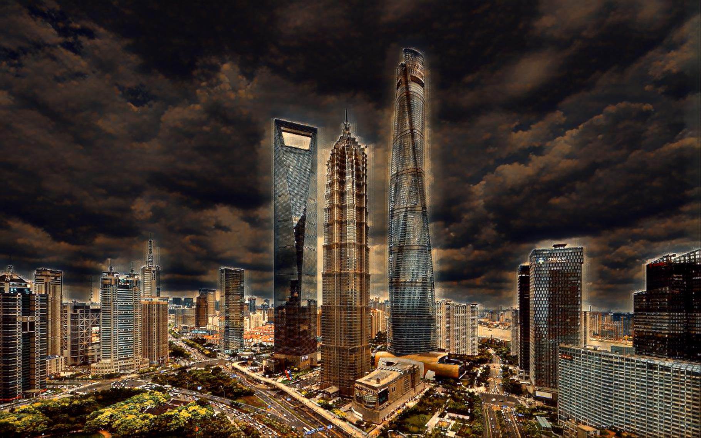

# fast-neural-style :
My implementation of fast-neural-style-transfer

I trained these these styles, the model can be found in the /model/ folder

  
  

  
  
  

I ran fast neural style transfer on some pictures. Here are the effects

  
  
<bar>
  
  
<bar>
  
  
   
<bar>
  
  

